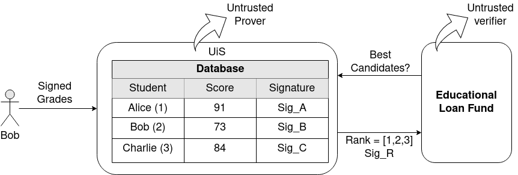

# Homomorphic Signatures

## Administrative

- Supervisor: Hein Meling and Rodrigo Saramago

## Prerequisites

- DAT510 Security and Vulnerability in Networks
- DAT520 Distributed Systems
- Strong math background
- Good understanding of cryptographic primitives
- Proficient in the Go programming language

## Project Description

The goal of this project is to implement the homomorphic signature scheme proposed by this [paper](https://theory.stanford.edu/~dfreeman/papers/homsigs.pdf) 
using the go programing language. You should be able to transform the specification into a library that can be used
by future projects.

## Tasks / Milestones

- Read and understand the signature scheme proposed in the [paper](https://theory.stanford.edu/~dfreeman/papers/homsigs.pdf)).
- Implement the proposed scheme in golang.
- Evaluate the performance of the implementation.
- Report on findings and lessons learned from the implementation, concluding on the feasibility of the developed signature
scheme for some real use cases (e.g. the academic use case mentioned in the paper).
 
## Background and Motivation

Homomorphic signatures allow users to delegate computation to untrusted parties while ensuring the integrity of the results.
This characteristic enables services over signed datasets without revealing more than necessary to the verifiers.

For instance, consider the image below based on this [slides](https://theory.stanford.edu/~dfreeman/talks/homsigs-IBM.pdf).
In the scenario below, a student (e.g., Bob) graduates at the University of Stavanger and gets
a signed certificate. Later on, the student would like to apply for a loan for his master's in another country,
but for that, he would need to submit his grades to the Educational Loan Fund somehow, so they would be able to
check if the student fulfills the requirements to get the loan.

That problem could be solved in many ways, the straightforward approach would give access to the Universities database to the loan agency,
but this could expose more data than necessary. Further, it could also increase the chances of data leaks
and potentially increase the bureaucracy to manage access over all the sensible data.

On the other hand, a solution using homomorphic encryption or homomorphic signatures could be used. In the latter,
the Loan agency would only have access to the result of a computation over the signed data, performed by the university.
Thus the process could be as follows:

- Bob receives his diploma and transcript of records (i.e., the grades dataset) from the UiS;
- Bob signs his grades dataset `G = {g1, g2, ..., gn}` using his private signing key;
- Bob uploads the signed data to the untrusted server at UiS;
- UiS issues a certificate to a trusted CA signing Bob's public key;
- Bob applies for a loan and provides his public key;
- The loan agency requests to the server the rank (e.g., GPA) of a set of students that applied to the program;
- The server can run some computation `r = f(G)` over the signed data to calculate the rank;
- The server can then homomorphically derive a short signature `sig_R`, certifying that `r` is the correct output of the computation `f`;
- The server publishes or sends `(f, r, sig_R)` to the loan agency;
- The agency (or anyone) can now verify the tuple `(f, r, sig_R)` using Bob's public verification key without having to retrieve the entire underlying data;

* Note: we consider that the UiS is untrusted in this case in the sense that Bob does not trust that UiS
  will perform the rank correctly and would like to be able to verify the results himself (since this process could be susceptible to frauds).
  Further, the loan agency is untrusted because Bob does not want to give them more information than they need
  to select the candidates for the loan (e.g., an authentic GPA).

## Reading Material

- [Paper: Homomorphic Signatures for Polynomial Functions](https://theory.stanford.edu/~dfreeman/papers/homsigs.pdf)
- [Slides](https://theory.stanford.edu/~dfreeman/talks/homsigs-IBM.pdf)
- [Applied Cryptography Book](https://toc.cryptobook.us/)
- [Reference implementation (in C++)](https://github.com/jasonyjong/Homomorphic-Signatures-for-Polynomial-Functions)
- [NTL Library (C++)](https://libntl.org/)
- [Botan Library (C++)](https://github.com/randombit/botan)
