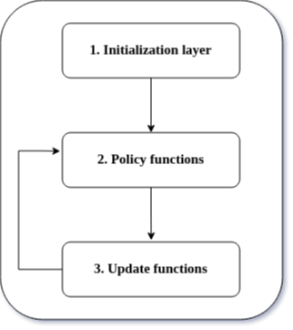

# A simulator in Go, on Swarm Storage Network

## Administrative

- Supervisor: Leander Jehl and Vahid Heidaripour Lakhani

## Prerequisites

- Go programming

## Project Description

Incentives are the moving force behind decentralized p2p networks that encourage nodes to participate in such networks and share their resources with others. As we can see from the literature, networks without proper incentives suffer from problems such as free-riding and churn. Thanks to the blockchain technology and cryptocurrencies, token-based incentives are now popular for these networks. Many parameters are involved in shaping a token-based incentive, and it is difficult to find the best combination that is fair while it can not be misused. To that end, building a simulation tool to try different parameters makes sense.
At the moment we have a simulation tool using the python programming language and the cadCAD simulation engine, to understand the bandwidth incentives of the Swarm storage network.

The goal for this project is to build the same simulation tool with Go programming language and compare it with the current python version on some metrics such as time and space complexity. The idea is to have a better version of the simulation tool which is faster and can handle bigger networks.

It is ideal to have a tool in this structure, where you can separately run the logic in the `Policy functions` layer and update the network in the `Update functions` layer.

## Tasks / Milestones

- Reading relevant papers
- Understand the Kademlia overlay network
- Simulate the p2p network based on Kademlia
- Add bandwidth incentive layer

## Reading material

[1] [Fair Incentivization of Bandwidth Sharing in 
Decentralized Storage Networks](https://arxiv.org/pdf/2208.07067.pdf)

[2] [Kademlia: A Peer-to-peer Information System Based on the XOR Metric](https://pdos.csail.mit.edu/~petar/papers/maymounkov-kademlia-lncs.pdf)

[3] [swap, swear and swindle: incentive system for Swarm](https://ethersphere.github.io/swarm-home/ethersphere/orange-papers/1/sw%5E3.pdf)